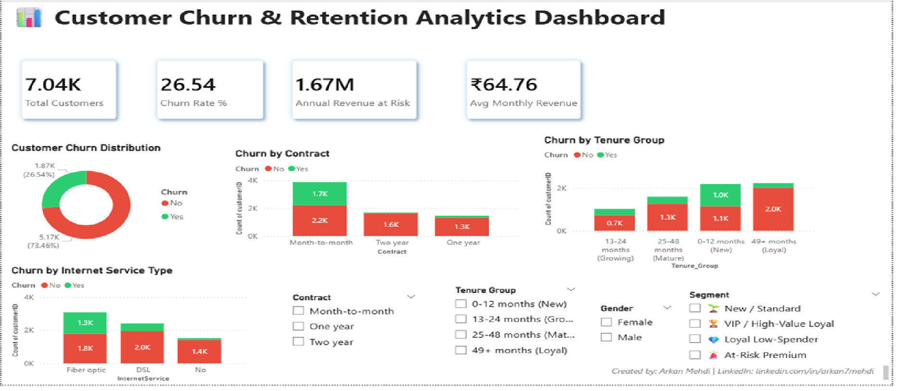

# 📊 Customer Churn Analysis & Retention Strategy

> End-to-end data analytics project predicting customer churn for a telecom company using Python and Power BI.

## 🎯 Project Overview

This project analyzes **7,043 telecom customers** to identify churn patterns, predict at-risk customers, and recommend retention strategies. The analysis revealed **₹1.67M in annual revenue at risk** and proposed five data-driven strategies to reduce churn by 30-40%.

## 💡 Business Problem

A leading telecom provider faces a **26.54% customer churn rate**, significantly above the industry average of 15-25%. This results in:

- 🚨 ~₹1.67M annual recurring revenue at risk
- 🚨 Increased customer acquisition costs
- 🚨 Loss of customer lifetime value

**Objective:** Identify churn drivers, segment at-risk customers, predict future churners, and recommend actionable retention strategies.

## 🛠️ Tools & Technologies

- **Programming:** Python (Pandas, NumPy, Matplotlib, Seaborn, Scikit-learn)
- **Visualization:** Power BI, Matplotlib, Seaborn
- **ML:** Logistic Regression (Scikit-learn)
- **Environment:** Google Colab, Power BI Desktop
- **Dataset:** IBM Telco Customer Churn (Kaggle)

## 🔍 Analysis Process

### 1. Data Cleaning & Preprocessing
- Handled 11 missing values in TotalCharges
- Created derived features: Tenure_Group, Segment, RFM_Score

### 2. Exploratory Data Analysis (EDA)
Investigated 8 key dimensions:
- Overall churn distribution
- Contract type impact
- Tenure patterns
- Pricing analysis
- Internet service quality
- Support services correlation
- Payment method analysis
- Demographic factors

### 3. Customer Segmentation
- **Rule-based:** VIP, Loyal Low-Spender, At-Risk Premium, New/Standard
- **RFM-style:** Champions, Loyal, Potential Loyalists, At-Risk, Lost

### 4. Machine Learning Model
- **Algorithm:** Logistic Regression
- **Accuracy:** 80%
- **ROC-AUC:** 84%

### 5. Interactive Dashboard (Power BI)
- 4 KPI Cards
- 5 Visualizations
- 4 Interactive Slicers
- 6 Custom DAX Measures

## 🎯 Key Findings

| Finding | Insight |
|---|---|
| **Contract Type** | Month-to-month: 42.7% churn vs 2-year: 2.8% (15x risk) |
| **Tenure** | First-year customers churn at 47% — critical window |
| **Internet Service** | Fiber Optic churns at 41.9% vs DSL at 19% |
| **Support** | No TechSupport = 3x higher churn |
| **Payment** | Electronic check users churn 45% |

## 💼 Recommended Strategies

1. **Contract Incentives** — Discount for longer commitments
2. **First-90-Days Onboarding** — Reduce new customer churn
3. **Fiber Optic Service Audit** — Investigate premium product issues
4. **Auto-Payment Promotion** — Migrate at-risk e-check users
5. **TechSupport Bundling** — Increase stickiness

**Expected Combined Impact:** Reduce churn from 26.54% to 15-18%, retaining ₹12-17 Lakhs annually.

## 📂 Project Files

- `Telco_Customer_Churn_Analysis.ipynb` — Python analysis notebook
- `Telco_Churn_Dashboard.pbix` — Power BI dashboard
- `Dashboard_Screenshot.png` — Dashboard preview
- `Business_Recommendations.pdf` — Strategic recommendations
- `telco_churn_*.csv` — Cleaned and processed datasets

## 🚀 How to Use

### View the Analysis
Open `Telco_Customer_Churn_Analysis.ipynb` in Google Colab or Jupyter Notebook

### View the Dashboard
1. Download `Telco_Churn_Dashboard.pbix`
2. Open with Power BI Desktop (free)
3. Interact with slicers to explore segments

## 👤 About Me

**[YOUR NAME]**  
🎓 [Your College Name]  
💼 LinkedIn: [linkedin.com/in/your-id](https://linkedin.com/in/your-id)  
📧 Email: your.email@gmail.com

---

⭐ If you found this project useful, please star this repository!
